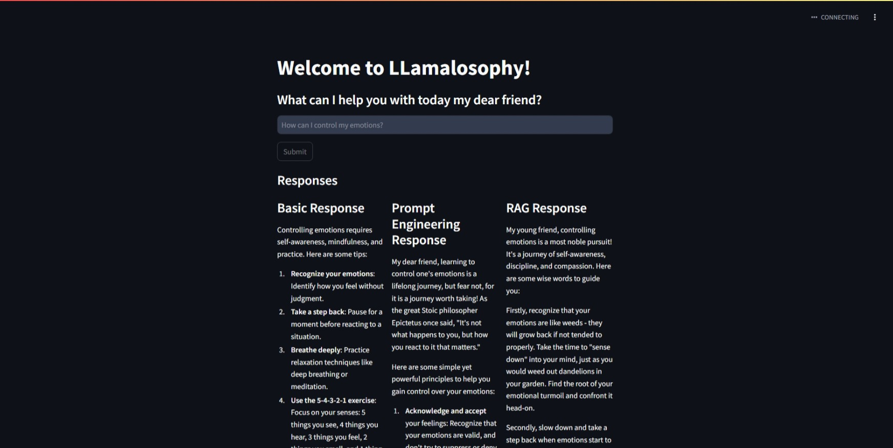
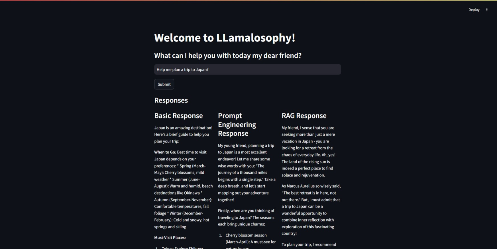
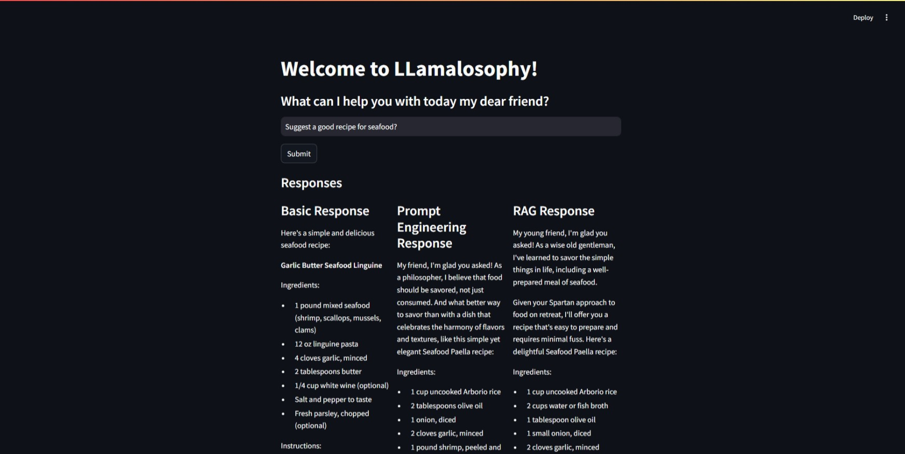

# Welcome to LLamalosophy!

This project represented a philosophy assistant made using the local LLama 3 model using Ollama. It was enhanced using prompt engineering and RAG with some common philosophy textbooks. This app also compares the same model with and without prompt engineering and RAG showcasing that simple prompt tuning and RAG support can go a long way in enhancing the model capabilities without having the need to fine-tune the model.

## Project Overview

The project is designed to meet the following key requirements:

- The user can philosophically enter any question and retrieve a response from the bot.
- This app uses local llama and can run completely offline.
- This app does not provide a flushed UI experience in terms of philosophy but provides a very good comparison of the bot's performance concerning prompts and RAG.
- Only basic prompting techniques are used and no advanced methods can be found as this is more focused on RAG.
- This project currently only supports PDF and MD. The PDF is converted to MD for easy processing and the MD is converted into embeddings and stored in chromadb.
- You can use the existing provided db or create your own db with your own documents.
- This project has support for any custom or local model but is only available using Ollama.
- This project needs not only to be a philosophy assistant it can be extended to be anything based on the prompt tuning and reference materials provided.

## Getting Started

To set up the project locally, follow these steps:

1. Clone this repository to your local machine.
2. A requirements file has been provided, you can install the requirements after creating a Python virtual environment.
3. Run the command `streamlit run philosopher.py` to start the server locally.
4. Access the application at the local host mentioned on the command line in your browser.

## Project Structure

The project structure is organized as follows:

- `create_markdown.py`: Converts the PDF files to Markdown files.
- `create_chroma.py`: Creates and saves a database of vector embeddings from the Markdown files.
- `philosopher.py`: Runs the actual app which can then be viewed and interacted with via a browser.

## Usage

Once the application is running, follow these steps to use it:

1. Access the application in your browser and navigate to the provided URL.
2. Use the interface to type in any question. Please try to stick to philosophy unless you have customized it.
3. You can view a comparison of three different responses with and without prompting and RAG techniques.
4. You can also view the associated backend prompts used to get the result.

## Notes
It could also be fun to see what type of answers you would get to non-philosophical questions like in the second and third images :) :P
